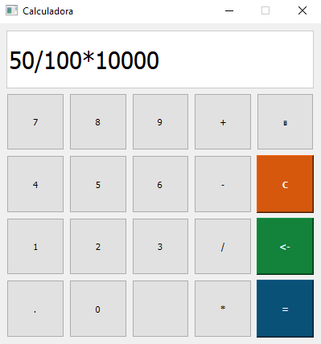

 
 
<div align="center" id="top">
  

 
  &#xa0;
 

 
 </div>
 
 
 <h1 align="center">Calculadora PyQT5</h1>


<!-- Status -->

<!-- <h4 align="center"> 
	🚧  Imersao Nextjs Alura 🚀 Em construção...  🚧
</h4> 


<hr> -->

 
 <p align="center">
  <a href="#dart-sobre">Sobre</a> &#xa0; | &#xa0; 
  <a href="#sparkles-funcionalidades">Funcionalidades</a> &#xa0; | &#xa0; 
  <a href="#rocket-tecnologias">Tecnologias</a> &#xa0; | &#xa0; 
  <a href="#white_check_mark-pré-requisitos">Pré-requisitos</a> &#xa0; | &#xa0;
  <a href="#checkered_flag-começando">Começando</a> &#xa0; | &#xa0;
</p>


<br>
	
## :dart: Sobre ##

```sh
• Calculadora feita com interface gráfica do python!
```

## :sparkles: Funcionalidades ##


:heavy_check_mark: 1º Calcular o que deseja;


## :rocket: Tecnologias ##
 
 
As seguintes ferramentas 🛠 foram utilizadas na construção do projeto:


- [python](https://www.python.org/downloads/)


## :white_check_mark: Pré-requisitos ##


Antes de começar 🏁, você vai precisar ter instalado em sua máquina as sequintes ferramentas:
[Git](https://git-scm.com/downloads) e [Python](https://www.python.org/downloads/).
Além disto é bom ter um editor para trabalhar com o código, tal como [VS Code](https://code.visualstudio.com/download)


## :checkered_flag: Começando ##


```bash
# Clone este repositorio
 $ git clone https://github.com/LucasFeliciano02/PyQT5_Calculadora.git

# Acesse a pasta do projeto que aparecerá em sua area de trabalho
 -> mouse esquerdo -> Abrir com Code

# Baixar Run Code em extensões e DESFRUTAR DO CÓDIGO

```


---


Made with :heart: by [Lucas Feliciano](https://github.com/LucasFeliciano02) | 👋 [See my Linkedin](https://www.linkedin.com/in/lucas-henrique-marques-feliciano-aa5aab222/)


 &#xa0;


<a href="#top">Voltar para o topo</a>
